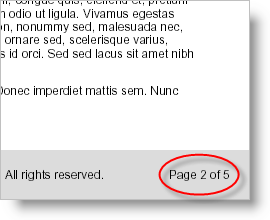

////

|metadata|
{
    "name": "documentengine-add-page-numbering",
    "controlName": ["Infragistics Document Engine"],
    "tags": [],
    "guid": "{6CE3A21C-1042-4D06-9771-EBBA7FD1D869}",  
    "buildFlags": [],
    "createdOn": "0001-01-01T00:00:00Z"
}
|metadata|
////

= Add Page Numbering

An excellent report element that helps your reader navigate a report is page numbering. Used in conjunction with a table of contents, your reader will be able to quickly scan the table of contents and decide which page the feature they want to read is on. Once the reader has the page number, it is a simple task to flip to that page (or enter the page number at the bottom of the Adobe Acrobat Reader's viewer).

You'll find the mechanism for adding page numbers in the Section element of the document object model. For more information on the Section element, see the link:documentengine-section.html[Section] topic. There is a  pick:[win-forms=" link:{ApiPlatform}documents.reports{ApiVersion}~infragistics.documents.reports.report.section.pagenumbering.html[PageNumbering]"]  pick:[asp-net=" link:{ApiPlatform}webui.documents.reports{ApiVersion}~infragistics.documents.reports.report.section.pagenumbering.html[PageNumbering]"]  pick:[win-forms-old=" link:{ApiPlatform}documents.reports{ApiVersion}~infragistics.documents.reports.report.section.pagenumbering.html[PageNumbering]"]  pick:[aspnet-old=" link:{ApiPlatform}webui.documents.reports{ApiVersion}~infragistics.documents.reports.report.section.pagenumbering.html[PageNumbering]"]  object available through the  pick:[win-forms=" link:{ApiPlatform}documents.reports{ApiVersion}~infragistics.documents.reports.report.section.isection~pagenumbering.html[PageNumbering]"]   pick:[asp-net=" link:{ApiPlatform}webui.documents.reports{ApiVersion}~infragistics.documents.reports.report.section.isection~pagenumbering.html[PageNumbering]"]   pick:[win-forms-old=" link:{ApiPlatform}documents.reports{ApiVersion}~infragistics.documents.reports.report.section.isection~pagenumbering.html[PageNumbering]"]   pick:[aspnet-old=" link:{ApiPlatform}webui.documents.reports{ApiVersion}~infragistics.documents.reports.report.section.isection~pagenumbering.html[PageNumbering]"]  property of the  pick:[win-forms=" link:{ApiPlatform}documents.reports{ApiVersion}~infragistics.documents.reports.report.section.isection.html[ISection]"]   pick:[asp-net=" link:{ApiPlatform}webui.documents.reports{ApiVersion}~infragistics.documents.reports.report.section.isection.html[ISection]"]   pick:[win-forms-old=" link:{ApiPlatform}documents.reports{ApiVersion}~infragistics.documents.reports.report.section.isection.html[ISection]"]   pick:[aspnet-old=" link:{ApiPlatform}webui.documents.reports{ApiVersion}~infragistics.documents.reports.report.section.isection.html[ISection]"]  object which holds all the required settings to add page numbering to your report.

.Note
[NOTE]
====
Be aware that the page numbering will display over all content, it is your responsibility as the developer to offset the content so it isn't overwritten.
====

 

The following code will add page numbering in the lower-right corner of the report. Pay special attention to the comments as they describe each property in greater detail.

*In Visual Basic:*

----
' Get a reference to the section's PageNumbering object.
Dim pn As Infragistics.Documents.Reports.Report.Section.PageNumbering = _  section1.PageNumbering
' Create a style for the page numbering font.
pn.Style = New Infragistics.Documents.Reports.Report.Text.Style(Fonts.Arial, Brushes.Black)
' The Template property is the actual string that
' shows the page numbering. Use the [Page #] place-
' holder for the current page and the [TotalPages]
' place-holder for the total amount of pages in
' the entire document.
pn.Template = "Page [Page #] of [TotalPages]"
' Setting SkipFirst to true does not place page
' numbering on the first page of the section. This
' is useful if the first page is a Title page.
pn.SkipFirst = False
' The page numbering will be aligned with the
' right side of the page. Valid values off the
' Alignment enum include Left, Center, and Right.
pn.Alignment.Horizontal = Infragistics.Documents.Reports.Report.Alignment.Right
' The page numbering will be located at the 
' bottom of the page. Valid values off the
' Alignment enum include Top and Bottom.
pn.Alignment.Vertical = Infragistics.Documents.Reports.Report.Alignment.Bottom
' The page numbering is at the extreme bottom
' of the page, so we need to change the Y Offset
' in order to bring it in line with the rest of
' the page footer text.
pn.OffsetY = -18
----

*In C#:*

----
// Get a reference to the section's PageNumbering object.
Infragistics.Documents.Reports.Report.Section.PageNumbering pn = _  section1.PageNumbering;
// Create a style for the page numbering font.
pn.Style = new Infragistics.Documents.Reports.Report.Text.Style(Fonts.Arial, Brushes.Black);
// The Template property is the actual string that
// shows the page numbering. Use the [Page #] place-
// holder for the current page and the [TotalPages]
// place-holder for the total amount of pages in
// the entire document.
pn.Template = "Page [Page #] of [TotalPages]";
// Setting SkipFirst to true does not place page
// numbering on the first page of the section. This
// is useful if the first page is a Title page.
pn.SkipFirst = false;
// The page numbering will be aligned with the
// right side of the page. Valid values off the
// Alignment enum include Left, Center, and Right.
pn.Alignment.Horizontal = Infragistics.Documents.Reports.Report.Alignment.Right;
// The page numbering will be located at the 
// bottom of the page. Valid values off the
// Alignment enum include Top and Bottom.
pn.Alignment.Vertical = Infragistics.Documents.Reports.Report.Alignment.Bottom;
// The page numbering is at the extreme bottom
// of the page, so we need to change the Y Offset
// in order to bring it in line with the rest of
// the page footer text.
pn.OffsetY = -18;
----