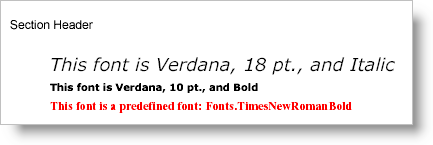

////

|metadata|
{
    "name": "documentengine-fonts",
    "controlName": ["Infragistics Document Engine"],
    "tags": [],
    "guid": "{7EBB7DC2-55FD-41F7-8897-C9DDF68FAE36}",  
    "buildFlags": [],
    "createdOn": "0001-01-01T00:00:00Z"
}
|metadata|
////

= Fonts

You can't write a report without text, so fonts will be an integral part of your report-writing experience. Of course, you could use all default settings for your text, but those defaults still use fonts (default font is Arial, 12 pt.). All you need in order to define a font is the name and size. There are several overloads for the  pick:[win-forms=" link:{ApiPlatform}documents.reports{ApiVersion}~infragistics.documents.reports.graphics.font~_ctor.html[Font]"]   pick:[asp-net=" link:{ApiPlatform}webui.documents.reports{ApiVersion}~infragistics.documents.reports.graphics.font~_ctor.html[Font]"]   pick:[win-forms-old=" link:{ApiPlatform}documents.reports{ApiVersion}~infragistics.documents.reports.graphics.font~_ctor.html[Font]"]   pick:[aspnet-old=" link:{ApiPlatform}webui.documents.reports{ApiVersion}~infragistics.documents.reports.graphics.font~_ctor.html[Font]"]  constructor that also give you other options when defining fonts such as  pick:[win-forms=" link:{ApiPlatform}documents.reports{ApiVersion}~infragistics.documents.reports.graphics.fontstyle.html[FontStyle]"]   pick:[asp-net=" link:{ApiPlatform}webui.documents.reports{ApiVersion}~infragistics.documents.reports.graphics.fontstyle.html[FontStyle]"]   pick:[win-forms-old=" link:{ApiPlatform}documents.reports{ApiVersion}~infragistics.documents.reports.graphics.fontstyle.html[FontStyle]"]   pick:[aspnet-old=" link:{ApiPlatform}webui.documents.reports{ApiVersion}~infragistics.documents.reports.graphics.fontstyle.html[FontStyle]"]  and location of the font (if it's not in the system's Fonts folder). There are a number of styles that you can add to your fonts through properties; for example:

*  pick:[win-forms=" link:{ApiPlatform}documents.reports{ApiVersion}~infragistics.documents.reports.graphics.font~bold.html[Bold]"]   pick:[asp-net=" link:{ApiPlatform}webui.documents.reports{ApiVersion}~infragistics.documents.reports.graphics.font~bold.html[Bold]"]   pick:[win-forms-old=" link:{ApiPlatform}documents.reports{ApiVersion}~infragistics.documents.reports.graphics.font~bold.html[Bold]"]   pick:[aspnet-old=" link:{ApiPlatform}webui.documents.reports{ApiVersion}~infragistics.documents.reports.graphics.font~bold.html[Bold]"] 
*  pick:[win-forms=" link:{ApiPlatform}documents.reports{ApiVersion}~infragistics.documents.reports.graphics.font~doublestrikeout.html[Double Strikeout]"]   pick:[asp-net=" link:{ApiPlatform}webui.documents.reports{ApiVersion}~infragistics.documents.reports.graphics.font~doublestrikeout.html[Double Strikeout]"]   pick:[win-forms-old=" link:{ApiPlatform}documents.reports{ApiVersion}~infragistics.documents.reports.graphics.font~doublestrikeout.html[Double Strikeout]"]   pick:[aspnet-old=" link:{ApiPlatform}webui.documents.reports{ApiVersion}~infragistics.documents.reports.graphics.font~doublestrikeout.html[Double Strikeout]"] 
*  pick:[win-forms=" link:{ApiPlatform}documents.reports{ApiVersion}~infragistics.documents.reports.graphics.font~doubleunderline.html[Double Underline]"]   pick:[asp-net=" link:{ApiPlatform}webui.documents.reports{ApiVersion}~infragistics.documents.reports.graphics.font~doubleunderline.html[Double Underline]"]   pick:[win-forms-old=" link:{ApiPlatform}documents.reports{ApiVersion}~infragistics.documents.reports.graphics.font~doubleunderline.html[Double Underline]"]   pick:[aspnet-old=" link:{ApiPlatform}webui.documents.reports{ApiVersion}~infragistics.documents.reports.graphics.font~doubleunderline.html[Double Underline]"] 
*  pick:[win-forms=" link:{ApiPlatform}documents.reports{ApiVersion}~infragistics.documents.reports.graphics.font~italic.html[Italic]"]   pick:[asp-net=" link:{ApiPlatform}webui.documents.reports{ApiVersion}~infragistics.documents.reports.graphics.font~italic.html[Italic]"]   pick:[win-forms-old=" link:{ApiPlatform}documents.reports{ApiVersion}~infragistics.documents.reports.graphics.font~italic.html[Italic]"]   pick:[aspnet-old=" link:{ApiPlatform}webui.documents.reports{ApiVersion}~infragistics.documents.reports.graphics.font~italic.html[Italic]"] 
*  pick:[win-forms=" link:{ApiPlatform}documents.reports{ApiVersion}~infragistics.documents.reports.graphics.font~strikeout.html[Strikeout]"]   pick:[asp-net=" link:{ApiPlatform}webui.documents.reports{ApiVersion}~infragistics.documents.reports.graphics.font~strikeout.html[Strikeout]"]   pick:[win-forms-old=" link:{ApiPlatform}documents.reports{ApiVersion}~infragistics.documents.reports.graphics.font~strikeout.html[Strikeout]"]   pick:[aspnet-old=" link:{ApiPlatform}webui.documents.reports{ApiVersion}~infragistics.documents.reports.graphics.font~strikeout.html[Strikeout]"] 
*  pick:[win-forms=" link:{ApiPlatform}documents.reports{ApiVersion}~infragistics.documents.reports.graphics.font~underline.html[Underline]"]   pick:[asp-net=" link:{ApiPlatform}webui.documents.reports{ApiVersion}~infragistics.documents.reports.graphics.font~underline.html[Underline]"]   pick:[win-forms-old=" link:{ApiPlatform}documents.reports{ApiVersion}~infragistics.documents.reports.graphics.font~underline.html[Underline]"]   pick:[aspnet-old=" link:{ApiPlatform}webui.documents.reports{ApiVersion}~infragistics.documents.reports.graphics.font~underline.html[Underline]"] 

Each of these styles is also available in the FontStyle enumeration, which is used when setting the  pick:[win-forms=" link:{ApiPlatform}documents.reports{ApiVersion}~infragistics.documents.reports.graphics.font~style.html[Style]"]   pick:[asp-net=" link:{ApiPlatform}webui.documents.reports{ApiVersion}~infragistics.documents.reports.graphics.font~style.html[Style]"]   pick:[win-forms-old=" link:{ApiPlatform}documents.reports{ApiVersion}~infragistics.documents.reports.graphics.font~style.html[Style]"]   pick:[aspnet-old=" link:{ApiPlatform}webui.documents.reports{ApiVersion}~infragistics.documents.reports.graphics.font~style.html[Style]"]  property. You can also access a collection of predefined fonts and styles using the  pick:[win-forms=" link:{ApiPlatform}documents.reports{ApiVersion}~infragistics.documents.reports.graphics.fonts.html[Fonts]"]   pick:[asp-net=" link:{ApiPlatform}webui.documents.reports{ApiVersion}~infragistics.documents.reports.graphics.fonts.html[Fonts]"]   pick:[win-forms-old=" link:{ApiPlatform}documents.reports{ApiVersion}~infragistics.documents.reports.graphics.fonts.html[Fonts]"]   pick:[aspnet-old=" link:{ApiPlatform}webui.documents.reports{ApiVersion}~infragistics.documents.reports.graphics.fonts.html[Fonts]"]  class. Keep in mind, though, that each font in the Fonts class is sealed and you cannot modify the style (e.g., add Bold or Underline).

'''

The example code below demonstrates a few common uses of the Font object by defining two fonts and using them in Text elements.

[start=1]
. *Define the Font objects.*

*In Visual Basic:*

----
Imports Infragistics.Documents.Reports.Report
Imports Infragistics.Documents.Reports.Graphics
.
.
.
' Define two font objects.
Dim verdanaBigItalic As New Font("Verdana", 18, FontStyle.Italic)
Dim verdanaSmallBold As New Font("Verdana", 10, FontStyle.Bold)
----

*In C#:*

----
using Infragistics.Documents.Reports.Report;
using Infragistics.Documents.Reports.Graphics;
.
.
.
// Define two font objects.
Font verdanaBigItalic = new Font("Verdana", 18, FontStyle.Italic);
Font verdanaSmallBold = new Font("Verdana", 10, FontStyle.Bold);
----

[start=2]
. *Add three Text elements to the main section (section1) and set their styles.*

*In Visual Basic:*

----
' Add a new Text element to the section and store the 
' reference fontText. Then set the style using the font
' created earlier and use a black brush.
Dim fontText As Infragistics.Documents.Reports.Report.Text.IText = section1.AddText()
fontText.Margins = New Margins(0, 3)
fontText.Style = _
  New Infragistics.Documents.Reports.Report.Text.Style(verdanaBigItalic, Brushes.Black)
fontText.AddContent("This font is Verdana, 18 pt., and Italic")
' Add another text element.
fontText = section1.AddText()
fontText.Margins = New Margins(0, 3)
fontText.Style = _
  New Infragistics.Documents.Reports.Report.Text.Style(verdanaSmallBold, Brushes.Black)
fontText.AddContent("This font is Verdana, 10 pt., and Bold")
' Add another text element; this time using a predefined font
' and changing the color to red.
fontText = section1.AddText()
fontText.Margins = New Margins(0, 3)
fontText.Style = _
  New Infragistics.Documents.Reports.Report.Text.Style( _
  Fonts.TimesNewRomanBold, Brushes.Red)
fontText.AddContent("This font is a predefined font: Fonts.TimesNewRomanBold")
----

*In C#:*

----
// Add a new Text element to the section and store the 
// reference fontText. Then set the style using the font
// created earlier and use a black brush.
Infragistics.Documents.Reports.Report.Text.IText fontText = section1.AddText();
fontText.Margins = new Margins(0, 3);
fontText.Style = 
  new Infragistics.Documents.Reports.Report.Text.Style(verdanaBigItalic, Brushes.Black);
fontText.AddContent("This font is Verdana, 18 pt., and Italic");
// Add another text element.
fontText = section1.AddText();
fontText.Margins = new Margins(0, 3);
fontText.Style = 
  new Infragistics.Documents.Reports.Report.Text.Style(verdanaSmallBold, Brushes.Black);
fontText.AddContent("This font is Verdana, 10 pt., and Bold");
// Add another text element; this time using a predefined font
// and changing the color to red.
fontText = section1.AddText();
fontText.Margins = new Margins(0, 3);
fontText.Style = 
  new Infragistics.Documents.Reports.Report.Text.Style( 
  Fonts.TimesNewRomanBold, Brushes.Red);
fontText.AddContent("This font is a predefined font: Fonts.TimesNewRomanBold");
----