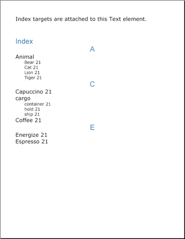

////

|metadata|
{
    "name": "documentengine-index",
    "controlName": ["Infragistics Document Engine"],
    "tags": [],
    "guid": "{21C85D2D-0E84-4C10-9F06-B7CEA8CA0F71}",  
    "buildFlags": [],
    "createdOn": "0001-01-01T00:00:00Z"
}
|metadata|
////

= Index

The Index element offers your readers a way to find specific words in your report. An index is a collection of words and phrases found inside the report that you gather alphabetically at the end of the report. Each word or phrase has a number associated with it; this number is the page in the report where your readers can find the word or phrase. If that word is found on multiple pages, multiple numbers representing those pages are associated with the word.

You can add a word to the index by calling the  pick:[win-forms="link:{ApiPlatform}documents.reports{ApiVersion}~infragistics.documents.reports.report.text.itext~addtarget.html[AddTarget]"]   pick:[asp-net="link:{ApiPlatform}webui.documents.reports{ApiVersion}~infragistics.documents.reports.report.text.itext~addtarget.html[AddTarget]"]   pick:[win-forms-old="link:{ApiPlatform}documents.reports{ApiVersion}~infragistics.documents.reports.report.text.itext~addtarget.html[AddTarget]"]   pick:[aspnet-old="link:{ApiPlatform}webui.documents.reports{ApiVersion}~infragistics.documents.reports.report.text.itext~addtarget.html[AddTarget]"]  method off the  pick:[win-forms="link:{ApiPlatform}documents.reports{ApiVersion}~infragistics.documents.reports.report.text.itext.html[IText]"]   pick:[asp-net="link:{ApiPlatform}webui.documents.reports{ApiVersion}~infragistics.documents.reports.report.text.itext.html[IText]"]   pick:[win-forms-old="link:{ApiPlatform}documents.reports{ApiVersion}~infragistics.documents.reports.report.text.itext.html[IText]"]   pick:[aspnet-old="link:{ApiPlatform}webui.documents.reports{ApiVersion}~infragistics.documents.reports.report.text.itext.html[IText]"]  interface. There are two overloads for this method; one accepts a string as the name of the target, the other accepts two strings as the name of the target and caption. You can add as many targets as necessary to a Text element. In order for the index to see a word on multiple pages, you need to add that word as a target to each Text element that it belongs to. The Index element uses these targets to create the index; therefore, it won't recognize if a word is in multiple locations unless you explicitly add that word to the index through the AddTarget method.

The Index element is very similar to the TOC element in that they are both created using levels. How many levels your index provides is completely up to you and the complexity of your report. Add a level to your index by calling the  pick:[win-forms="link:{ApiPlatform}documents.reports{ApiVersion}~infragistics.documents.reports.report.index.iindex~addlevel.html[AddLevel]"]   pick:[asp-net="link:{ApiPlatform}webui.documents.reports{ApiVersion}~infragistics.documents.reports.report.index.iindex~addlevel.html[AddLevel]"]   pick:[win-forms-old="link:{ApiPlatform}documents.reports{ApiVersion}~infragistics.documents.reports.report.index.iindex~addlevel.html[AddLevel]"]   pick:[aspnet-old="link:{ApiPlatform}webui.documents.reports{ApiVersion}~infragistics.documents.reports.report.index.iindex~addlevel.html[AddLevel]"]  method off the  pick:[win-forms="link:{ApiPlatform}documents.reports{ApiVersion}~infragistics.documents.reports.report.index.iindex.html[IIndex]"]   pick:[asp-net="link:{ApiPlatform}webui.documents.reports{ApiVersion}~infragistics.documents.reports.report.index.iindex.html[IIndex]"]   pick:[win-forms-old="link:{ApiPlatform}documents.reports{ApiVersion}~infragistics.documents.reports.report.index.iindex.html[IIndex]"]   pick:[aspnet-old="link:{ApiPlatform}webui.documents.reports{ApiVersion}~infragistics.documents.reports.report.index.iindex.html[IIndex]"]  interface. The most common index configuration is two levels deep. This configuration allows for compound words or phrases to be grouped under the same category. For example, you need to add the following three compound words to the index: cargo container, cargo hold, and cargo ship. You would add them just as you would normally, giving each word a separate target name by calling AddTarget three times. The only difference would be in the caption of the target. You separate index levels in the caption by using a colon (:). Using this rule, the caption for "cargo hold" would be "cargo:hold". This would place the word "hold" underneath the word "cargo" in the index, making use of the second level as demonstrated in the screen shot above. How you wish to group words and phrases together is completely up to you.

'''

The following code creates a Text element and adds several targets in order to populate the index. An index is then created with two levels.

[start=1]
. *Create two Style objects to use in the index.*

*In Visual Basic:*

----
Imports Infragistics.Documents.Reports.Report
.
.
.
Dim mainStyle1 As New _
  Infragistics.Documents.Reports.Report.Text.Style( _
  New Font("Verdana", 18), Brushes.Black)
Dim mainStyle2 As New _
  Infragistics.Documents.Reports.Report.Text.Style( _
  New Font("Arial", 24), Brushes.SteelBlue)
----

*In C#:*

----
using Infragistics.Documents.Reports.Report;
.
.
.
Infragistics.Documents.Reports.Report.Text.Style mainStyle1 = 
  new Infragistics.Documents.Reports.Report.Text.Style( 
  new Font("Verdana", 18), Brushes.Black);
Infragistics.Documents.Reports.Report.Text.Style mainStyle2 = 
  new Infragistics.Documents.Reports.Report.Text.Style( 
  new Font("Arial", 24), Brushes.SteelBlue);
----

[start=2]
. *Create a new Section to place the index in.*

*In Visual Basic:*

----
Dim indexSection As Infragistics.Documents.Reports.Report.Section.ISection = _  report.AddSection()
indexSection.PageMargins = New Margins(50)
----

*In C#:*

----
Infragistics.Documents.Reports.Report.Section.ISection indexSection =   report.AddSection();
indexSection.PageMargins = new Margins(50);
----

[start=3]
. *Create the Text element and add targets to it.*

*In Visual Basic:*

----
Dim indexText As Infragistics.Documents.Reports.Report.Text.IText = _  indexSection.AddText()
indexText.Style = mainStyle1
indexText.AddContent("Index targets are attached to this Text element.")
indexText.AddTarget("Bear", "Animal:Bear")
indexText.AddTarget("Tiger", "Animal:Tiger")
indexText.AddTarget("Cat", "Animal:Cat")
indexText.AddTarget("Lion", "Animal:Lion")
indexText.AddTarget("cargo hold", "cargo:hold")
indexText.AddTarget("cargo container", "cargo:container")
indexText.AddTarget("cargo ship", "cargo:ship")
indexText.AddTarget("Coffee", "Coffee")
indexText.AddTarget("Espresso", "Espresso")
indexText.AddTarget("Capuccino", "Capuccino")
indexText.AddTarget("Energize", "Energize")
----

*In C#:*

----
Infragistics.Documents.Reports.Report.Text.IText indexText =   indexSection.AddText();
indexText.Style = mainStyle1;
indexText.AddContent("Index targets are attached to this Text element.");
indexText.AddTarget("Bear", "Animal:Bear");
indexText.AddTarget("Tiger", "Animal:Tiger");
indexText.AddTarget("Cat", "Animal:Cat");
indexText.AddTarget("Lion", "Animal:Lion");
indexText.AddTarget("cargo hold", "cargo:hold");
indexText.AddTarget("cargo container", "cargo:container");
indexText.AddTarget("cargo ship", "cargo:ship");
indexText.AddTarget("Coffee", "Coffee");
indexText.AddTarget("Espresso", "Espresso");
indexText.AddTarget("Capuccino", "Capuccino");
indexText.AddTarget("Energize", "Energize");
----

[start=4]
. *Create a Gap to add space between the Text element and the soon-to-be-created Index element.*

*In Visual Basic:*

----
Dim indexGap As Infragistics.Documents.Reports.Report.IGap = indexSection.AddGap()
indexGap.Height = New FixedHeight(50)
----

*In C#:*

----
Infragistics.Documents.Reports.Report.IGap indexGap = indexSection.AddGap();
indexGap.Height = new FixedHeight(50);
----

[start=5]
. *Create a heading for the index.*

*In Visual Basic:*

----
Dim indexHeading As Infragistics.Documents.Reports.Report.Text.IText = _  indexSection.AddText()
indexHeading.Style = mainStyle2
indexHeading.AddContent("Index")
----

*In C#:*

----
Infragistics.Documents.Reports.Report.Text.IText indexHeading =   indexSection.AddText();
indexHeading.Style = mainStyle2;
indexHeading.AddContent("Index");
----

[start=6]
. *Define an Index element and add two levels.*

*In Visual Basic:*

----
Dim index As Infragistics.Documents.Reports.Report.Index.IIndex = _  indexSection.AddIndex()
index.Alphabet.Style = mainStyle2
Dim indexLevel As Infragistics.Documents.Reports.Report.Index.IIndexLevel = _  index.AddLevel()
indexLevel.Style = mainStyle1
indexLevel = index.AddLevel()
indexLevel.Style = mainStyle1
indexLevel.Indents.Left = 30
indexLevel.Style = _
  New Infragistics.Documents.Reports.Report.Text.Style( _
  New Font("Verdana", 14), Brushes.Black)
----

*In C#:*

----
Infragistics.Documents.Reports.Report.Index.IIndex index =   indexSection.AddIndex();
index.Alphabet.Style = mainStyle2;
Infragistics.Documents.Reports.Report.Index.IIndexLevel indexLevel =   index.AddLevel();
indexLevel.Style = mainStyle1;
indexLevel = index.AddLevel();
indexLevel.Style = mainStyle1;
indexLevel.Indents.Left = 30;
indexLevel.Style = 
  new Infragistics.Documents.Reports.Report.Text.Style( 
  new Font("Verdana", 14), Brushes.Black);
----