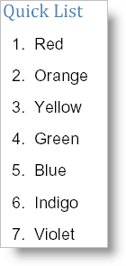

////

|metadata|
{
    "name": "documentengine-quick-list",
    "controlName": ["Infragistics Document Engine"],
    "tags": [],
    "guid": "{7315066B-C595-4523-A681-7353E131ECF4}",  
    "buildFlags": [],
    "createdOn": "0001-01-01T00:00:00Z"
}
|metadata|
////

= Quick List

Using the Quick List element is the easiest way to add a simple bulleted or numbered list to your report. Quick List has only the essential features to maintain its light-weight presence. If you need a much more customizable list element, see link:documentengine-lists.html[Lists]. As with the other link:documentengine-quick-content.html[quick content] elements, you create a Quick List by calling the AddQuickList method of most layout elements. Unlike the Quick Image and Quick Text elements, there is one more step required to create the list; you need to add items. However, adding items to the list isn't difficult at all; call the  pick:[win-forms=" link:{ApiPlatform}documents.reports{ApiVersion}~infragistics.documents.reports.report.quicklist.iquicklist~additem.html[AddItem]"]   pick:[asp-net=" link:{ApiPlatform}webui.documents.reports{ApiVersion}~infragistics.documents.reports.report.quicklist.iquicklist~additem.html[AddItem]"]   pick:[win-forms-old=" link:{ApiPlatform}documents.reports{ApiVersion}~infragistics.documents.reports.report.quicklist.iquicklist~additem.html[AddItem]"]   pick:[aspnet-old=" link:{ApiPlatform}webui.documents.reports{ApiVersion}~infragistics.documents.reports.report.quicklist.iquicklist~additem.html[AddItem]"]  method off the  pick:[win-forms=" link:{ApiPlatform}documents.reports{ApiVersion}~infragistics.documents.reports.report.quicklist.iquicklist.html[IQuickList]"]   pick:[asp-net=" link:{ApiPlatform}webui.documents.reports{ApiVersion}~infragistics.documents.reports.report.quicklist.iquicklist.html[IQuickList]"]   pick:[win-forms-old=" link:{ApiPlatform}documents.reports{ApiVersion}~infragistics.documents.reports.report.quicklist.iquicklist.html[IQuickList]"]   pick:[aspnet-old=" link:{ApiPlatform}webui.documents.reports{ApiVersion}~infragistics.documents.reports.report.quicklist.iquicklist.html[IQuickList]"]  interface and supply it with a string. There are other options available to you such as the  pick:[win-forms=" link:{ApiPlatform}documents.reports{ApiVersion}~infragistics.documents.reports.report.quicklist.iquicklist~numbered.html[Numbered]"]   pick:[asp-net=" link:{ApiPlatform}webui.documents.reports{ApiVersion}~infragistics.documents.reports.report.quicklist.iquicklist~numbered.html[Numbered]"]   pick:[win-forms-old=" link:{ApiPlatform}documents.reports{ApiVersion}~infragistics.documents.reports.report.quicklist.iquicklist~numbered.html[Numbered]"]   pick:[aspnet-old=" link:{ApiPlatform}webui.documents.reports{ApiVersion}~infragistics.documents.reports.report.quicklist.iquicklist~numbered.html[Numbered]"]  property which identifies whether the list will be bulleted or numbered. Another useful property is the  pick:[win-forms=" link:{ApiPlatform}documents.reports{ApiVersion}~infragistics.documents.reports.report.quicklist.iquicklist~interval.html[Interval]"]   pick:[asp-net=" link:{ApiPlatform}webui.documents.reports{ApiVersion}~infragistics.documents.reports.report.quicklist.iquicklist~interval.html[Interval]"]   pick:[win-forms-old=" link:{ApiPlatform}documents.reports{ApiVersion}~infragistics.documents.reports.report.quicklist.iquicklist~interval.html[Interval]"]   pick:[aspnet-old=" link:{ApiPlatform}webui.documents.reports{ApiVersion}~infragistics.documents.reports.report.quicklist.iquicklist~interval.html[Interval]"]  property which sets the space in-between each item.

The following code creates a list of seven items. The list will be numbered and each item will have 10 pixels of space between them. This topic assumes that you have a Report element defined with at least one Section element added to it. See link:documentengine-report.html[Report] and link:documentengine-section.html[Section] for more information.

*In Visual Basic:*

----
' Add a quick list
section1.AddQuickText("Quick List")
Dim quickList As Infragistics.Documents.Reports.Report.QuickList.IQuickList = _  quickSection.AddQuickList()
quickList.Numbered = True
quickList.Interval = 10
' Add items to the list
quickList.AddItem("Red")
quickList.AddItem("Orange")
quickList.AddItem("Yellow")
quickList.AddItem("Green")
quickList.AddItem("Blue")
quickList.AddItem("Indigo")
quickList.AddItem("Violet")
----

*In C#:*

----
// Add a quick list
section1.AddQuickText("Quick List");
Infragistics.Documents.Reports.Report.QuickList.IQuickList quickList =   section1.AddQuickList();
quickList.Numbered = true;
quickList.Interval = 10;
// Add items to the list
quickList.AddItem("Red");
quickList.AddItem("Orange");
quickList.AddItem("Yellow");
quickList.AddItem("Green");
quickList.AddItem("Blue");
quickList.AddItem("Indigo");
quickList.AddItem("Violet");
----