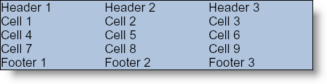

////

|metadata|
{
    "name": "documentengine-quick-table",
    "controlName": ["Infragistics Document Engine"],
    "tags": [],
    "guid": "{FBCD9A92-3F02-497C-8B44-7D2EF4695FD0}",  
    "buildFlags": [],
    "createdOn": "0001-01-01T00:00:00Z"
}
|metadata|
////

= Quick Table

The Quick Table element is definitely the heaviest of the light-weight link:documentengine-quick-content.html[Quick Content] elements only because a table naturally contains several elements. You can add the following elements to the Quick Table element:

* Column
* Row
* Cell
* Header
* Divider
* Footer

You can also set several properties that will modify the appearance of the Quick Table element:

* Background
* Borders
* Paddings
* Margins

The Quick Table element uses several of the features of the full Table element, See link:documentengine-tables.html[Tables] for more information. Columns, Rows, and Cells are all repeatable content, meaning you can add as many of those elements as you need. However, the Header, Divider, and Footer elements are not repeatable; there is only one Header, Divider, and Footer per page. Although the Header and Footer elements are not repeatable, their cells are. These two elements each contain an AddCell method used to add additional cells to the Header or Footer elements. You can also add cells to a Row element in much the same way. Therefore, creating a table full of cells (whether in a Header, Row, or Footer) is as easy as calling one method per cell.

'''

The following code creates a simple 3 x 3 table plus headers and footers. The background color of the table is set to LightSteelBlue and the border color is set to Black. This topic assumes that you have a Report element defined with at least one Section element added to it. See link:documentengine-report.html[Report] and link:documentengine-section.html[Section] for more information.

*In Visual Basic:*

----
' Add a quick table
section1.AddQuickText("Quick Table")
Dim quickTable As Infragistics.Documents.Reports.Report.QuickTable.IQuickTable = _  quickSection.AddQuickTable()
' Add black borders to the outside of the table
quickTable.Borders = New Borders(New Pen(New Color(0, 0, 0)))
' Add a lightsteelblue background to the entire table
quickTable.Background = New Background(Brushes.LightSteelBlue)
' Add three columns
quickTable.AddColumn(100)
quickTable.AddColumn(100)
quickTable.AddColumn(100)
' Add Header cells
Dim quickTableHeader As _
  Infragistics.Documents.Reports.Report.QuickTable.IQuickTableHeader = _
  quickTable.Header
quickTableHeader.AddCell("Header 1")
quickTableHeader.AddCell("Header 2")
quickTableHeader.AddCell("Header 3")
' Add three rows with three cells each
Dim quickRow As Infragistics.Documents.Reports.Report.QuickTable.IQuickTableRow = _
  quickTable.AddRow()
quickRow.AddCell("Cell 1")
quickRow.AddCell("Cell 2")
quickRow.AddCell("Cell 3")
quickRow = quickTable.AddRow()
quickRow.AddCell("Cell 4")
quickRow.AddCell("Cell 5")
quickRow.AddCell("Cell 6")
quickRow = quickTable.AddRow()
quickRow.AddCell("Cell 7")
quickRow.AddCell("Cell 8")
quickRow.AddCell("Cell 9")
' Add Footer cells
Dim quickTableFooter As _
  Infragistics.Documents.Reports.Report.QuickTable.IQuickTableFooter = _
  quickTable.Footer
quickTableFooter.AddCell("Footer 1")
quickTableFooter.AddCell("Footer 2")
quickTableFooter.AddCell("Footer 3")
----

*In C#:*

----
section1.AddQuickText("Quick Table");
// Add a quick table
Infragistics.Documents.Reports.Report.QuickTable.IQuickTable quickTable =   section1.AddQuickTable();
// Add black borders to the outside of the table
quickTable.Borders = new Borders(new Pen(new Color(0, 0, 0)));
// Add a lightsteelblue background to the entire table
quickTable.Background = new Background(Brushes.LightSteelBlue);
// Add three columns
quickTable.AddColumn(100);
quickTable.AddColumn(100);
quickTable.AddColumn(100);
// Add Header cells
Infragistics.Documents.Reports.Report.QuickTable.IQuickTableHeader quickTableHeader =   quickTable.Header;
quickTableHeader.AddCell("Header 1");
quickTableHeader.AddCell("Header 2");
quickTableHeader.AddCell("Header 3");
// Add three rows with three cells each
Infragistics.Documents.Reports.Report.QuickTable.IQuickTableRow quickRow =   quickTable.AddRow();
quickRow.AddCell("Cell 1");
quickRow.AddCell("Cell 2");
quickRow.AddCell("Cell 3");
quickRow = quickTable.AddRow();
quickRow.AddCell("Cell 4");
quickRow.AddCell("Cell 5");
quickRow.AddCell("Cell 6");
quickRow = quickTable.AddRow();
quickRow.AddCell("Cell 7");
quickRow.AddCell("Cell 8");
quickRow.AddCell("Cell 9");
// Add Footer cells
Infragistics.Documents.Reports.Report.QuickTable.IQuickTableFooter quickTableFooter =   quickTable.Footer;
quickTableFooter.AddCell("Footer 1");
quickTableFooter.AddCell("Footer 2");
quickTableFooter.AddCell("Footer 3");
----