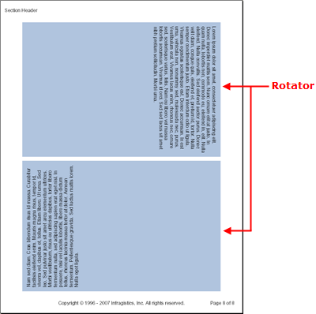

////

|metadata|
{
    "name": "documentengine-rotator",
    "controlName": ["Infragistics Document Engine"],
    "tags": [],
    "guid": "{26019034-4A5F-4047-812A-23E9F75665DB}",  
    "buildFlags": [],
    "createdOn": "0001-01-01T00:00:00Z"
}
|metadata|
////

= Rotator

The Rotator element rotates its content either 90 degrees clockwise or 90 degrees counter-clockwise. Content is rotated counter-clockwise by default, but by setting the  pick:[win-forms=" link:{ApiPlatform}documents.reports{ApiVersion}~infragistics.documents.reports.report.irotator~backward.html[Backward]"]   pick:[asp-net=" link:{ApiPlatform}webui.documents.reports{ApiVersion}~infragistics.documents.reports.report.irotator~backward.html[Backward]"]   pick:[win-forms-old=" link:{ApiPlatform}documents.reports{ApiVersion}~infragistics.documents.reports.report.irotator~backward.html[Backward]"]   pick:[aspnet-old=" link:{ApiPlatform}webui.documents.reports{ApiVersion}~infragistics.documents.reports.report.irotator~backward.html[Backward]"]  property to True, you can rotate the content clockwise. The Rotator element should be used when all you need to do is simply rotate content at a 90 degree angle. If you need to rotate content at a 45 degree angle or any other angle, you need to use the Site element. For more information on the Site element, see link:documentengine-site.html[Site].

In the image to the right, you see two Text elements inside of Rotator elements. The first Rotator element rotates the text 90 degrees clockwise by setting the Backward property to True. A Stretcher element was also necessary as the text was left-aligned. The second Rotator element is the exact opposite of the first.

'''

The following code creates a page in a report similar to the screen shot above.

Use the following text to set the the `string1` variable:

[source]
----
Lorem ipsum dolor sit amet, consectetuer adipiscing elit. Donec imperdiet mattis sem. Nunc ornare elit at justo. In quam nulla, lobortis non, commodo eu, eleifend in, elit. Nulla eleifend. Nulla convallis. Sed eleifend auctor purus. Donec velit diam, congue quis, eleifend et, pretium id, tortor. Nulla semper condimentum justo. Etiam interdum odio ut ligula. Vivamus egestas scelerisque est. Donec accumsan. In est urna, vehicula non, nonummy sed, malesuada nec, purus. Vestibulum erat. Vivamus lacus enim, rhoncus nec, ornare sed, scelerisque varius, felis. Nam eu libero vel massa lobortis accumsan. Vivamus id orci. Sed sed lacus sit amet nibh pretium sollicitudin. Morbi urna.
----

*In Visual Basic:*

----
Imports Infragistics.Documents.Reports.Report
.
.
.
Dim string1 As String = "Lorem ipsum..."
' Define a Rotator element and add it to a section.
Dim rotator1 As Infragistics.Documents.Reports.Report.IRotator = section1.AddRotator()
' Define a Text element and add it to the rotator.
' Add content to the Text element. You may replace
' 'string1' with some text.
Dim rotatorText1 As Infragistics.Documents.Reports.Report.Text.IText = rotator1.AddText()
rotatorText1.AddContent(string1)
' Set standard properties to help us see the rotator
' better. The Backward property flips the content 180
' degrees. The AddStretcher method stretches the content
' to the bottom (right side since it's rotated 90 degrees)
' of the content area.
rotator1.Backward = True
rotator1.Background = New Background(Brushes.LightSteelBlue)
rotator1.Height = New RelativeHeight(50)
rotator1.Paddings.All = 10
rotator1.Margins.All = 5
rotator1.AddStretcher()
' Define another rotator, same as above. This time, the text
' will be rotated to the opposite direction and will be at the
' top (left side since it's rotated -90 degrees) of the content
' area.
Dim rotator2 As Infragistics.Documents.Reports.Report.IRotator = section1.AddRotator()
Dim rotatorText2 As Infragistics.Documents.Reports.Report.Text.IText = rotator2.AddText()
rotatorText2.AddContent(string1)
rotator2.Backward = False
rotator2.Background = New Background(Brushes.LightSteelBlue)
rotator2.Height = New RelativeHeight(100)
rotator2.Paddings.All = 10
rotator2.Margins.All = 5
----

*In C#:*

----
using Infragistics.Documents.Reports.Report;
.
.
.
string string1 = "Lorem ipsum...";
// Define a Rotator element and add it to a section.
Infragistics.Documents.Reports.Report.IRotator rotator1 = section1.AddRotator();
// Define a Text element and add it to the rotator.
// Add content to the Text element. You may replace
// 'string1' with some text.
Infragistics.Documents.Reports.Report.Text.IText rotatorText1 = rotator1.AddText();
rotatorText1.AddContent(string1);
// Set standard properties to help us see the rotator
// better. The Backward property flips the content 180
// degrees. The AddStretcher method stretches the content
// to the bottom (right side since it's rotated 90 degrees)
// of the content area.
rotator1.Backward = true;
rotator1.Background = new Background(Brushes.LightSteelBlue);
rotator1.Height = new RelativeHeight(50);
rotator1.Paddings.All = 10;
rotator1.Margins.All = 5;
rotator1.AddStretcher();
// Define another rotator, same as above. This time, the text
// will be rotated to the opposite direction and will be at the
// top (left side since it's rotated -90 degrees) of the content
// area.
Infragistics.Documents.Reports.Report.IRotator rotator2 = section1.AddRotator();
Infragistics.Documents.Reports.Report.Text.IText rotatorText2 = rotator2.AddText();
rotatorText2.AddContent(string1);
rotator2.Backward = false;
rotator2.Background = new Background(Brushes.LightSteelBlue);
rotator2.Height = new RelativeHeight(100);
rotator2.Paddings.All = 10;
rotator2.Margins.All = 5;
----