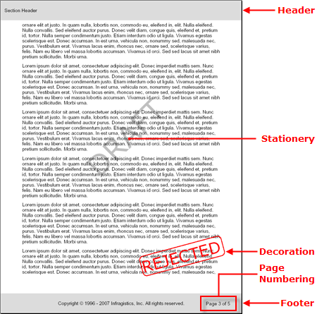

////

|metadata|
{
    "name": "documentengine-section-element",
    "controlName": ["Infragistics Document Engine"],
    "tags": [],
    "guid": "{DADD015A-31FC-41ED-B05A-E252EB9B2C8F}",  
    "buildFlags": [],
    "createdOn": "0001-01-01T00:00:00Z"
}
|metadata|
////

= Section Element

The Section element is the only layout element that you can add to the Report element. This makes the Section element unique in several ways:

* The Section element can contain every layout element (except another Section element)
* You can add individual pages to a report through the Section element
* The Section element can contain Stationery and Decoration elements to use as watermarks and stamps. No other layout element can contain these two elements.
* Through the Section element, you can link:documentengine-add-page-numbering.html[add page numbering] to your report.

These unique features of the Section element allow you to organize your report on a high level as well as apply several necessary settings to the report as a whole.

'''

The following code will define a  pick:[win-forms=" link:{ApiPlatform}documents.reports{ApiVersion}~infragistics.documents.reports.report.report.html[Report]"]   pick:[asp-net=" link:{ApiPlatform}webui.documents.reports{ApiVersion}~infragistics.documents.reports.report.report.html[Report]"]   pick:[win-forms-old=" link:{ApiPlatform}documents.reports{ApiVersion}~infragistics.documents.reports.report.report.html[Report]"]   pick:[aspnet-old=" link:{ApiPlatform}webui.documents.reports{ApiVersion}~infragistics.documents.reports.report.report.html[Report]"]  and add a single  pick:[win-forms=" link:{ApiPlatform}documents.reports{ApiVersion}~infragistics.documents.reports.report.section.isection.html[ISection]"]   pick:[asp-net=" link:{ApiPlatform}webui.documents.reports{ApiVersion}~infragistics.documents.reports.report.section.isection.html[ISection]"]   pick:[win-forms-old=" link:{ApiPlatform}documents.reports{ApiVersion}~infragistics.documents.reports.report.section.isection.html[ISection]"]   pick:[aspnet-old=" link:{ApiPlatform}webui.documents.reports{ApiVersion}~infragistics.documents.reports.report.section.isection.html[ISection]"]  to it. The Section will include headers, footers, stationery, and decorations.

[start=1]
. *Define the Report and Section.*

*In Visual Basic:*

----
Imports Infragistics.Documents.Reports.Report
.
.
.
Dim report As Infragistics.Documents.Reports.Report.Report = New Report()
' Create the main Section and add 50 pixels of
' padding on each edge.
Dim section1 As Infragistics.Documents.Reports.Report.Section.ISection = _
  report.AddSection()
section1.PagePaddings.Left = 50
section1.PagePaddings.Right = 50
----

*In C#:*

----
using Infragistics.Documents.Reports.Report;
.
.
.
Infragistics.Documents.Reports.Report.Report report = new Report();
// Create the main Section and add 50 pixels of padding on each edge.
Infragistics.Documents.Reports.Report.Section.ISection section1 = 
  report.AddSection();
section1.PagePaddings.Left = 50;
section1.PagePaddings.Right = 50;
----

[start=2]
. *Add a Header element to the Section.*

*In Visual Basic:*

----
Dim sectionHeader As Infragistics.Documents.Reports.Report.Section.ISectionHeader = _  section1.AddHeader()
sectionHeader.Repeat = True
sectionHeader.Height = 50
Dim sectionHeaderText As Infragistics.Documents.Reports.Report.Text.IText = _  sectionHeader.AddText(0, 0)
sectionHeaderText.Paddings.All = 10
sectionHeaderText.Alignment = _
  New TextAlignment(Alignment.Left, Alignment.Middle)
sectionHeaderText.Height = New RelativeHeight(100)
sectionHeaderText.AddContent("Section Header")
----

*In C#:*

----
Infragistics.Documents.Reports.Report.Section.ISectionHeader sectionHeader =   section1.AddHeader();
sectionHeader.Repeat = true;
sectionHeader.Height = 50;
Infragistics.Documents.Reports.Report.Text.IText sectionHeaderText =   sectionHeader.AddText(0, 0);
sectionHeaderText.Paddings.All = 10;
sectionHeaderText.Alignment = 
  new TextAlignment(Alignment.Left, Alignment.Middle);
sectionHeaderText.Height = new RelativeHeight(100);
sectionHeaderText.AddContent("Section Header");
----

[start=3]
. *Add a Stationery element to the Section.*

*In Visual Basic:*

----
' Add a stationery element to the report.
' This element will read "DRAFT" in large
' letters at an angle beneath the content
' of the report.
Dim stationery As Infragistics.Documents.Reports.Report.Section.IStationery = _  section1.AddStationery()
stationery.Repeat = True
Dim stationeryText As Infragistics.Documents.Reports.Report.Text.IText = _  stationery.AddText(200, 400, -45)
stationeryText.Style = New Style(New Font("Verdana", 72), Brushes.Silver)
stationeryText.AddContent("DRAFT")
----

*In C#:*

----
// Add a stationery element to the report.
// This element will read "DRAFT" in large
// letters at an angle beneath the content
// of the report.
Infragistics.Documents.Reports.Report.Section.IStationery stationery =   section1.AddStationery();
stationery.Repeat = true;
Infragistics.Documents.Reports.Report.Text.IText stationeryText =   stationery.AddText(200, 400, -45);
stationeryText.Style = new Style(new Font("Verdana", 72), Brushes.Silver);
stationeryText.AddContent("DRAFT");
----

[start=4]
. *Add a Decoration element to the Section.*

*In Visual Basic:*

----
' Add a decoration element to the report.
' This element will serve as a stamp that
' will say "REJECTED" in large letters
' over the content of the report.
Dim decoration As Infragistics.Documents.Reports.Report.Section.IDecoration = _  section1.AddDecoration()
decoration.MasterRange = MasterRange.All
decoration.Rear = False
Dim decorationText As Infragistics.Documents.Reports.Report.Text.IText = _  decoration.AddText(350, 650, -15)
decorationText.Style = New Style(New Font("Verdana", 40), Brushes.Red)
decorationText.Width = New RelativeWidth(35)
decorationText.Borders = _
  New Borders(New Pen(Colors.Red, 3, DashStyle.Solid), 10)
decorationText.AddContent("REJECTED")
----

*In C#:*

----
// Add a decoration element to the report.
// This element will serve as a stamp that
// will say "REJECTED" in large letters
// over the content of the report.
Infragistics.Documents.Reports.Report.Section.IDecoration decoration =   section1.AddDecoration();
decoration.MasterRange = MasterRange.All;
decoration.Rear = false;
Infragistics.Documents.Reports.Report.Text.IText decorationText =   decoration.AddText(350, 650, -15);
decorationText.Style = new Style(new Font("Verdana", 40), Brushes.Red);
decorationText.Width = new RelativeWidth(35);
decorationText.Borders = 
  new Borders(new Pen(Colors.Red, 3, DashStyle.Solid), 10);
decorationText.AddContent("REJECTED");
----

[start=5]
. *Add a Footer element to the Section.*

*In Visual Basic:*

----
Dim sectionFooter As Infragistics.Documents.Reports.Report.Section.ISectionFooter = _  section1.AddFooter()
sectionFooter.Repeat = True
sectionFooter.Height = 50
Dim sectionFooterText As Infragistics.Documents.Reports.Report.Text.IText = _  sectionFooter.AddText(0, 0)
sectionFooterText.Paddings.All = 10
sectionFooterText.Alignment = _
  New TextAlignment(Alignment.Center, Alignment.Middle)
sectionFooterText.Height = New RelativeHeight(100)
sectionFooterText.Background = New Background(Brushes.Gainsboro)
sectionFooterText.AddContent("Copyright  1996 - 2007 Infragistics," & _
  " Inc. All rights reserved.")
----

*In C#:*

----
Infragistics.Documents.Reports.Report.Section.ISectionFooter sectionFooter =   section1.AddFooter();
sectionFooter.Repeat = true;
sectionFooter.Height = 50;
Infragistics.Documents.Reports.Report.Text.IText sectionFooterText =   sectionFooter.AddText(0, 0);
sectionFooterText.Paddings.All = 10;
sectionFooterText.Alignment = 
  new TextAlignment(Alignment.Center, Alignment.Middle);
sectionFooterText.Height = new RelativeHeight(100);
sectionFooterText.Background = new Background(Brushes.Gainsboro);
sectionFooterText.AddContent("Copyright © 1996 - 2007 Infragistics, Inc." +
  " All rights reserved.");
----