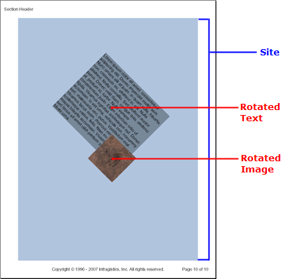

////

|metadata|
{
    "name": "documentengine-site",
    "controlName": ["Infragistics Document Engine"],
    "tags": [],
    "guid": "{2E713222-6301-455D-AA08-FD1A6A9AA649}",  
    "buildFlags": [],
    "createdOn": "0001-01-01T00:00:00Z"
}
|metadata|
////

= Site

The Site element affords you the ultimate customizability in placing layout elements on a page. Using the Site element, you can place elements using their x- and y-coordinates, and even rotate them to any angle.

The Site element doesn't have unique properties that make it different from other layout elements; instead, each method that adds content elements contains two overloads. These overloads allow you to place each layout element separately wherever you chose.

The first overload of each layout element method accepts two floats, the distance from the left side of the Site element and the distance from the top of the Site element. The second overload accepts an additional float that controls the angle at which the layout element should be placed.

'''

The following code adds a Site element to a Section element and then adds Text and Image elements to the Site element. The Text element is rotated 45 degrees and the Image element is rotated -45 degrees similar to the image above. This topic assumes that you already have a  pick:[win-forms=" link:{ApiPlatform}documents.reports{ApiVersion}~infragistics.documents.reports.report.report.html[Report]"]   pick:[asp-net=" link:{ApiPlatform}webui.documents.reports{ApiVersion}~infragistics.documents.reports.report.report.html[Report]"]   pick:[win-forms-old=" link:{ApiPlatform}documents.reports{ApiVersion}~infragistics.documents.reports.report.report.html[Report]"]   pick:[aspnet-old=" link:{ApiPlatform}webui.documents.reports{ApiVersion}~infragistics.documents.reports.report.report.html[Report]"]  defined along with a  pick:[win-forms=" link:{ApiPlatform}documents.reports{ApiVersion}~infragistics.documents.reports.report.section.isection.html[Section]"]   pick:[asp-net=" link:{ApiPlatform}webui.documents.reports{ApiVersion}~infragistics.documents.reports.report.section.isection.html[Section]"]   pick:[win-forms-old=" link:{ApiPlatform}documents.reports{ApiVersion}~infragistics.documents.reports.report.section.isection.html[Section]"]   pick:[aspnet-old=" link:{ApiPlatform}webui.documents.reports{ApiVersion}~infragistics.documents.reports.report.section.isection.html[Section]"]  element added.

Use the following text to set the the `string1` variable:

[source]
----
Lorem ipsum dolor sit amet, consectetuer adipiscing elit. Donec imperdiet mattis sem. Nunc ornare elit at justo. In quam nulla, lobortis non, commodo eu, eleifend in, elit. Nulla eleifend. Nulla convallis. Sed eleifend auctor purus. Donec velit diam, congue quis, eleifend et, pretium id, tortor. Nulla semper condimentum justo. Etiam interdum odio ut ligula. Vivamus egestas scelerisque est. Donec accumsan. In est urna, vehicula non, nonummy sed, malesuada nec, purus. Vestibulum erat. Vivamus lacus enim, rhoncus nec, ornare sed, scelerisque varius, felis. Nam eu libero vel massa lobortis accumsan. Vivamus id orci. Sed sed lacus sit amet nibh pretium sollicitudin. Morbi urna.
----

*In Visual Basic:*

----
Imports Infragistics.Documents.Reports.Report
.
.
.
Dim string1 As String = "Lorem ipsum..."
' Define a new Site element and color its background.
Dim site As Infragistics.Documents.Reports.Report.ISite = section1.AddSite()
site.Background = New Background(Brushes.LightSteelBlue)
' Add a Text element to the Site element. The text element
' will be placed 250 pixels to the left and 100 pixels down
' and rotated 45 degrees clockwise.
Dim siteText As Infragistics.Documents.Reports.Report.Text.IText = site.AddText(250, 100, 45)
' Replace string1 with some text.
siteText.AddContent(string1)
' Color the Background of the Text element.
siteText.Background = New Background(Brushes.LightSlateGray)
' The Text element will only be half the width of the Site element.
siteText.Width = New RelativeWidth(50)
' Add an Image element to the Site element. The Image element
' will be placed 200 pixels to the left and 100 pixels down
' and rotated 45 degrees counter-clockwise.
Dim siteImage As Infragistics.Documents.Reports.Report.IImage = _  site.AddImage(New Image("C:\Windows\Coffee Bean.bmp"), 200, 400, -45)
----

*In C#:*

----
using Infragistics.Documents.Reports.Report;
.
.
.
string string1 = "Lorem ipsum...";
// Define a new Site element and color its background.
Infragistics.Documents.Reports.Report.ISite site = section1.AddSite();
site.Background = new Background(Brushes.LightSteelBlue);
// Add a Text element to the Site element. The text element
// will be placed 250 pixels to the left and 100 pixels down
// and rotated 45 degrees clockwise.
Infragistics.Documents.Reports.Report.Text.IText siteText = site.AddText(250,100,45);
// Replace string1 with some text.
siteText.AddContent(string1);
// Color the Background of the Text element.
siteText.Background = new Background(Brushes.LightSlateGray);
// The Text element will only be half the width of the Site element.
siteText.Width = new RelativeWidth(50);
// Add an Image element to the Site element. The Image element
// will be placed 200 pixels to the left and 100 pixels down
// and rotated 45 degrees counter-clockwise.
Infragistics.Documents.Reports.Report.IImage siteImage =   site.AddImage(new Image(@"C:\Windows\Coffee Bean.bmp"), 200, 400, -45);
----