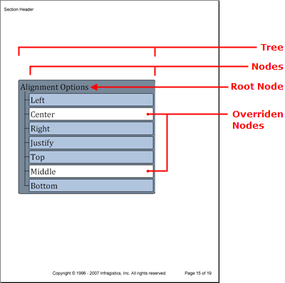

////

|metadata|
{
    "name": "documentengine-trees",
    "controlName": ["Infragistics Document Engine"],
    "tags": [],
    "guid": "{94B73CC1-E2B2-445A-BC0C-535DA92DE219}",  
    "buildFlags": [],
    "createdOn": "0001-01-01T00:00:00Z"
}
|metadata|
////

= Trees

The Tree element is useful for displaying hierarchical relationships by showing how parent nodes, especially the root node, own their child nodes and all nodes beneath them in the hierarchy. The Tree element's object model consists of a main tree object with a  pick:[win-forms=" link:{ApiPlatform}documents.reports{ApiVersion}~infragistics.documents.reports.report.tree.itree~root.html[Root]"]   pick:[asp-net=" link:{ApiPlatform}webui.documents.reports{ApiVersion}~infragistics.documents.reports.report.tree.itree~root.html[Root]"]   pick:[win-forms-old=" link:{ApiPlatform}documents.reports{ApiVersion}~infragistics.documents.reports.report.tree.itree~root.html[Root]"]   pick:[aspnet-old=" link:{ApiPlatform}webui.documents.reports{ApiVersion}~infragistics.documents.reports.report.tree.itree~root.html[Root]"]  property to identify the root node of the tree. Once you've gotten a reference to the root node (which is of type  pick:[win-forms=" link:{ApiPlatform}documents.reports{ApiVersion}~infragistics.documents.reports.report.tree.inode.html[INode]"]   pick:[asp-net=" link:{ApiPlatform}webui.documents.reports{ApiVersion}~infragistics.documents.reports.report.tree.inode.html[INode]"]   pick:[win-forms-old=" link:{ApiPlatform}documents.reports{ApiVersion}~infragistics.documents.reports.report.tree.inode.html[INode]"]   pick:[aspnet-old=" link:{ApiPlatform}webui.documents.reports{ApiVersion}~infragistics.documents.reports.report.tree.inode.html[INode]"]  ), you can call the  pick:[win-forms=" link:{ApiPlatform}documents.reports{ApiVersion}~infragistics.documents.reports.report.tree.inode~addnode.html[AddNode]"]   pick:[asp-net=" link:{ApiPlatform}webui.documents.reports{ApiVersion}~infragistics.documents.reports.report.tree.inode~addnode.html[AddNode]"]   pick:[win-forms-old=" link:{ApiPlatform}documents.reports{ApiVersion}~infragistics.documents.reports.report.tree.inode~addnode.html[AddNode]"]   pick:[aspnet-old=" link:{ApiPlatform}webui.documents.reports{ApiVersion}~infragistics.documents.reports.report.tree.inode~addnode.html[AddNode]"]  method off the INode interface to add additional nodes to the tree. You can add as many or as few nodes as you like, but there will only be one root node.

As with all link:documentengine-pattern-content.html[pattern content], you can implement style changes by adding patterns to the following tree elements:

* the tree as a whole (the  pick:[win-forms=" link:{ApiPlatform}documents.reports{ApiVersion}~infragistics.documents.reports.report.tree.treepattern.html[TreePattern]"]   pick:[asp-net=" link:{ApiPlatform}webui.documents.reports{ApiVersion}~infragistics.documents.reports.report.tree.treepattern.html[TreePattern]"]   pick:[win-forms-old=" link:{ApiPlatform}documents.reports{ApiVersion}~infragistics.documents.reports.report.tree.treepattern.html[TreePattern]"]   pick:[aspnet-old=" link:{ApiPlatform}webui.documents.reports{ApiVersion}~infragistics.documents.reports.report.tree.treepattern.html[TreePattern]"]  class applies a style to the  pick:[win-forms=" link:{ApiPlatform}documents.reports{ApiVersion}~infragistics.documents.reports.report.tree.itree.html[ITree]"]   pick:[asp-net=" link:{ApiPlatform}webui.documents.reports{ApiVersion}~infragistics.documents.reports.report.tree.itree.html[ITree]"]   pick:[win-forms-old=" link:{ApiPlatform}documents.reports{ApiVersion}~infragistics.documents.reports.report.tree.itree.html[ITree]"]   pick:[aspnet-old=" link:{ApiPlatform}webui.documents.reports{ApiVersion}~infragistics.documents.reports.report.tree.itree.html[ITree]"]  interface)
* the tree nodes, not their content (the  pick:[win-forms=" link:{ApiPlatform}documents.reports{ApiVersion}~infragistics.documents.reports.report.tree.treenodepattern.html[TreeNodePattern]"]   pick:[asp-net=" link:{ApiPlatform}webui.documents.reports{ApiVersion}~infragistics.documents.reports.report.tree.treenodepattern.html[TreeNodePattern]"]   pick:[win-forms-old=" link:{ApiPlatform}documents.reports{ApiVersion}~infragistics.documents.reports.report.tree.treenodepattern.html[TreeNodePattern]"]   pick:[aspnet-old=" link:{ApiPlatform}webui.documents.reports{ApiVersion}~infragistics.documents.reports.report.tree.treenodepattern.html[TreeNodePattern]"]  class applies a style to the  pick:[win-forms=" link:{ApiPlatform}documents.reports{ApiVersion}~infragistics.documents.reports.report.tree.inode.html[INode]"]   pick:[asp-net=" link:{ApiPlatform}webui.documents.reports{ApiVersion}~infragistics.documents.reports.report.tree.inode.html[INode]"]   pick:[win-forms-old=" link:{ApiPlatform}documents.reports{ApiVersion}~infragistics.documents.reports.report.tree.inode.html[INode]"]   pick:[aspnet-old=" link:{ApiPlatform}webui.documents.reports{ApiVersion}~infragistics.documents.reports.report.tree.inode.html[INode]"]  interface)
* the caption of the tree nodes (the  pick:[win-forms=" link:{ApiPlatform}documents.reports{ApiVersion}~infragistics.documents.reports.report.tree.treecaptionpattern.html[TreeCaptionPattern]"]   pick:[asp-net=" link:{ApiPlatform}webui.documents.reports{ApiVersion}~infragistics.documents.reports.report.tree.treecaptionpattern.html[TreeCaptionPattern]"]   pick:[win-forms-old=" link:{ApiPlatform}documents.reports{ApiVersion}~infragistics.documents.reports.report.tree.treecaptionpattern.html[TreeCaptionPattern]"]   pick:[aspnet-old=" link:{ApiPlatform}webui.documents.reports{ApiVersion}~infragistics.documents.reports.report.tree.treecaptionpattern.html[TreeCaptionPattern]"]  class applies a style to the  pick:[win-forms=" link:{ApiPlatform}documents.reports{ApiVersion}~infragistics.documents.reports.report.tree.icaption.html[ICaption]"]   pick:[asp-net=" link:{ApiPlatform}webui.documents.reports{ApiVersion}~infragistics.documents.reports.report.tree.icaption.html[ICaption]"]   pick:[win-forms-old=" link:{ApiPlatform}documents.reports{ApiVersion}~infragistics.documents.reports.report.tree.icaption.html[ICaption]"]   pick:[aspnet-old=" link:{ApiPlatform}webui.documents.reports{ApiVersion}~infragistics.documents.reports.report.tree.icaption.html[ICaption]"]  interface)

As you can see from the list above, each pattern applies to a more granular level of the tree; and if that’s not enough, you can override each pattern by setting specific properties on each node.

'''

The following code creates a tree with one root node and seven child nodes. You will first create patterns for the tree, nodes, and captions, create the tree, and then add the nodes.

[start=1]
. *Create patterns for the tree, nodes, and captions.*

*In Visual Basic:*

----
Imports Infragistics.Documents.Reports.Report
.
.
.
' Create a new pattern for the tree as a whole.
Dim treePattern As New Infragistics.Documents.Reports.Report.Tree.TreePattern()
treePattern.Background = New Background(Brushes.LightSlateGray)
treePattern.Paddings = New Paddings(5)
treePattern.Borders = New Borders(New Pen(New Color(0, 0, 0)), 5)
' Create a new pattern for tree nodes.
Dim treeNodePattern As New Infragistics.Documents.Reports.Report.Tree.TreeNodePattern()
treeNodePattern.Lines = New Lines(New Pen(New Color(0, 0, 0)))
treeNodePattern.Interval = 5
treeNodePattern.Indent = 25
' Create a new pattern for captions.
Dim treeCaptionPattern As New _
  Infragistics.Documents.Reports.Report.Tree.TreeCaptionPattern()
treeCaptionPattern.Background = New Background(Brushes.LightSteelBlue)
treeCaptionPattern.Borders = New Borders(New Pen(New Color(0, 0, 0)), 3)
treeCaptionPattern.Paddings = New Paddings(3)
----

*In C#:*

----
using Infragistics.Documents.Reports.Report;
.
.
.
// Create a new pattern for the tree as a whole.
Infragistics.Documents.Reports.Report.Tree.TreePattern treePattern = new TreePattern();
treePattern.Background = new Background(Brushes.LightSlateGray);
treePattern.Paddings = new Paddings(5);
treePattern.Borders = new Borders(new Pen(new Color(0, 0, 0)), 5);
// Create a new pattern for tree nodes.
Infragistics.Documents.Reports.Report.Tree.TreeNodePattern treeNodePattern = 
  new TreeNodePattern();
treeNodePattern.Lines = new Lines(new Pen(new Color(0, 0, 0)));
treeNodePattern.Interval = 5;
treeNodePattern.Indent = 25;
// Create a new pattern for captions.
Infragistics.Documents.Reports.Report.Tree.TreeCaptionPattern treeCaptionPattern = 
  new TreeCaptionPattern();
treeCaptionPattern.Background = new Background(Brushes.LightSteelBlue);
treeCaptionPattern.Borders = new Borders(new Pen(new Color(0, 0, 0)), 3);
treeCaptionPattern.Paddings = new Paddings(3);
----

[start=2]
. *Create the tree, apply the tree pattern, and then add a caption for the root node.*

*In Visual Basic:*

----
' Create the tree and get a reference to the
' tree's root node.
Dim tree As Infragistics.Documents.Reports.Report.Tree.ITree = section1.AddTree()
tree.ApplyPattern(treePattern)
tree.Width = New RelativeWidth(75)
Dim rootNode As Infragistics.Documents.Reports.Report.Tree.INode = tree.Root
treeNodePattern.Apply(rootNode)
Dim nodeText As Infragistics.Documents.Reports.Report.QuickText.IQuickText
' Add a caption to the root node.
Dim rootCaption As Infragistics.Documents.Reports.Report.Tree.ICaption = _
  rootNode.Caption
nodeText = rootCaption.AddQuickText("Alignment Options")
nodeText.Font = New Infragistics.Documents.Reports.Graphics.Font("Verdana", 24)
----

*In C#:*

----
// Create the tree and get a reference to the
// tree's root node.
Infragistics.Documents.Reports.Report.Tree.ITree tree = section1.AddTree();
tree.ApplyPattern(treePattern);
tree.Width = new RelativeWidth(75);
Infragistics.Documents.Reports.Report.Tree.INode rootNode = tree.Root;
treeNodePattern.Apply(rootNode);
Infragistics.Documents.Reports.Report.QuickText.IQuickText nodeText;
// Add a caption to the root node.
Infragistics.Documents.Reports.Report.Tree.ICaption rootCaption = rootNode.Caption;
nodeText = rootCaption.AddQuickText("Alignment Options");
nodeText.Font = new Infragistics.Documents.Reports.Graphics.Font("Verdana", 24);
----

[start=3]
. *Create the child nodes.*

The following code loops through the  pick:[win-forms=" link:{ApiPlatform}documents.reports{ApiVersion}~infragistics.documents.reports.report.alignment.html[Alignment]"]   pick:[asp-net=" link:{ApiPlatform}webui.documents.reports{ApiVersion}~infragistics.documents.reports.report.alignment.html[Alignment]"]   pick:[win-forms-old=" link:{ApiPlatform}documents.reports{ApiVersion}~infragistics.documents.reports.report.alignment.html[Alignment]"]   pick:[aspnet-old=" link:{ApiPlatform}webui.documents.reports{ApiVersion}~infragistics.documents.reports.report.alignment.html[Alignment]"]  enumeration and retrieves the strings to populate the tree nodes. When the loop encounters the strings "Center" or "Middle", it will override the pattern for those nodes and change the background color to white.

*In Visual Basic:*

----
Dim childNode As Infragistics.Documents.Reports.Report.Tree.INode;
Dim childNodeCaption As Infragistics.Documents.Reports.Report.Tree.ICaption;
For Each s As String In [Enum].GetNames(GetType(Alignment))
	If s = "Center" OrElse s = "Middle" Then
		childNode = rootNode.AddNode()
		childNodeCaption = childNode.Caption
		treeCaptionPattern.Apply(childNodeCaption)
		' Override the Background of the TreeCaptionPattern
		childNodeCaption.Background = New Background(Brushes.White)
		nodeText = childNodeCaption.AddQuickText(s)
		nodeText.Font = _
		  New Infragistics.Documents.Reports.Graphics.Font("Verdana", 24)
	Else
		childNode = rootNode.AddNode()
		childNodeCaption = childNode.Caption
		treeCaptionPattern.Apply(childNodeCaption)
		nodeText = childNodeCaption.AddQuickText(s)
		nodeText.Font = _
		  New Infragistics.Documents.Reports.Graphics.Font("Verdana", 24)
	End If
Next s
----

*In C#:*

----
INode childNode;
ICaption childNodeCaption;
foreach (string s in Enum.GetNames(typeof(Alignment)))
{
	if (s == "Center" || s == "Middle")
	{
		childNode = rootNode.AddNode();
		childNodeCaption = childNode.Caption;
		treeCaptionPattern.Apply(childNodeCaption);
		// Override the Background of the TreeCaptionPattern
		childNodeCaption.Background = new Background(Brushes.White);
		nodeText = childNodeCaption.AddQuickText(s);
		nodeText.Font = 
		  new Infragistics.Documents.Reports.Graphics.Font("Verdana", 24);
	}
	else
	{
		childNode = rootNode.AddNode();
		childNodeCaption = childNode.Caption;
		treeCaptionPattern.Apply(childNodeCaption);
		nodeText = childNodeCaption.AddQuickText(s);
		nodeText.Font = 
		  new Infragistics.Documents.Reports.Graphics.Font("Verdana", 24);
	}
}
----